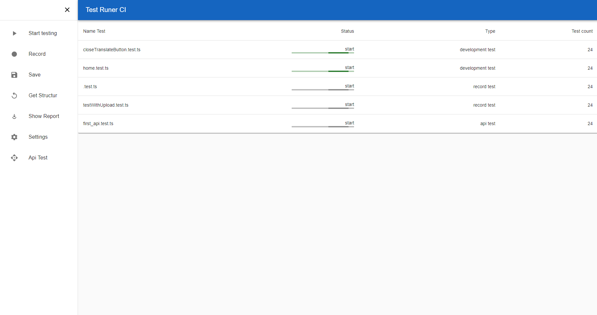
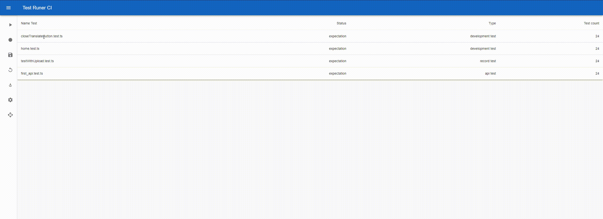
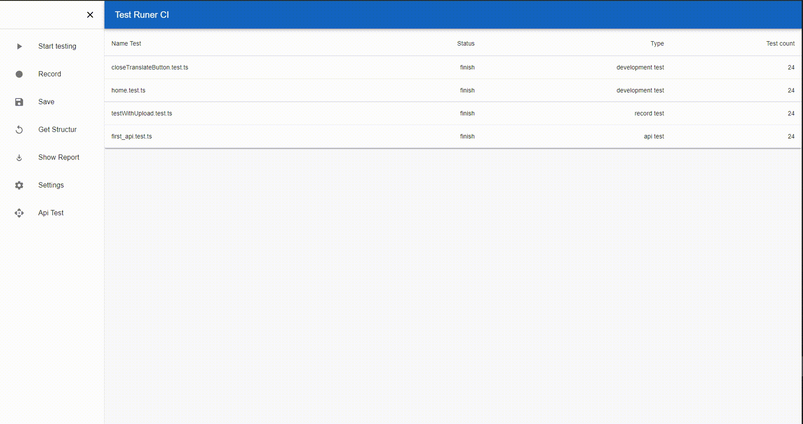
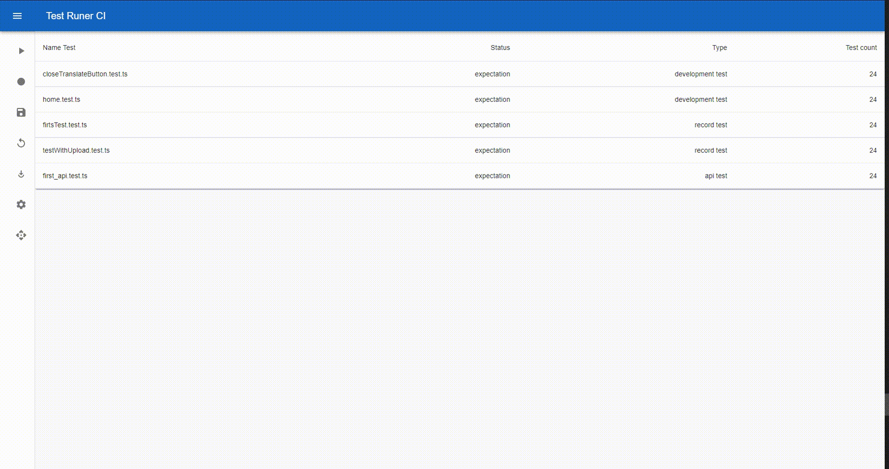
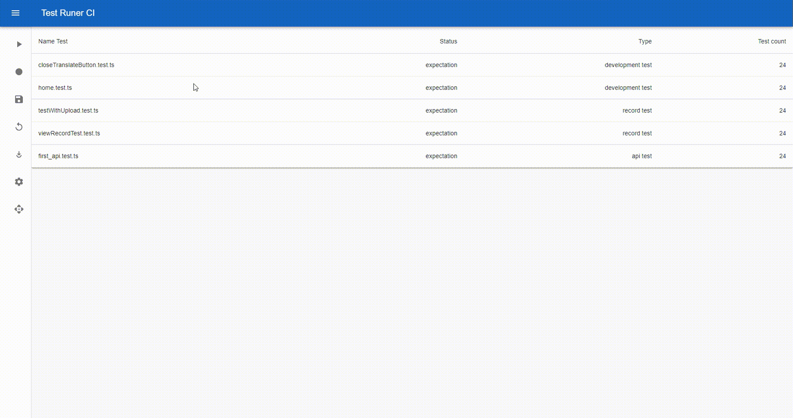
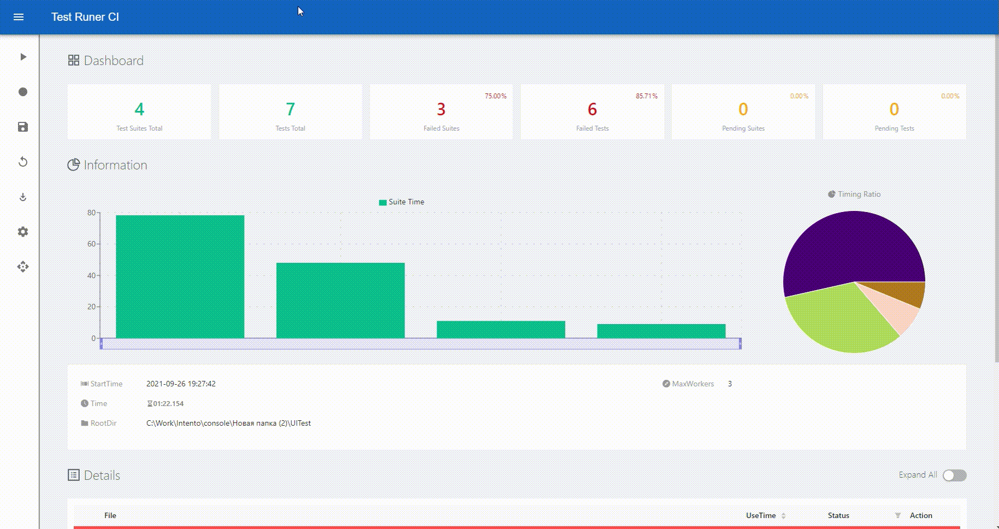
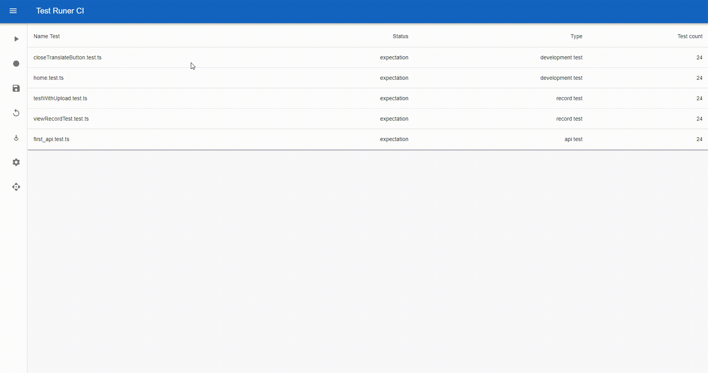
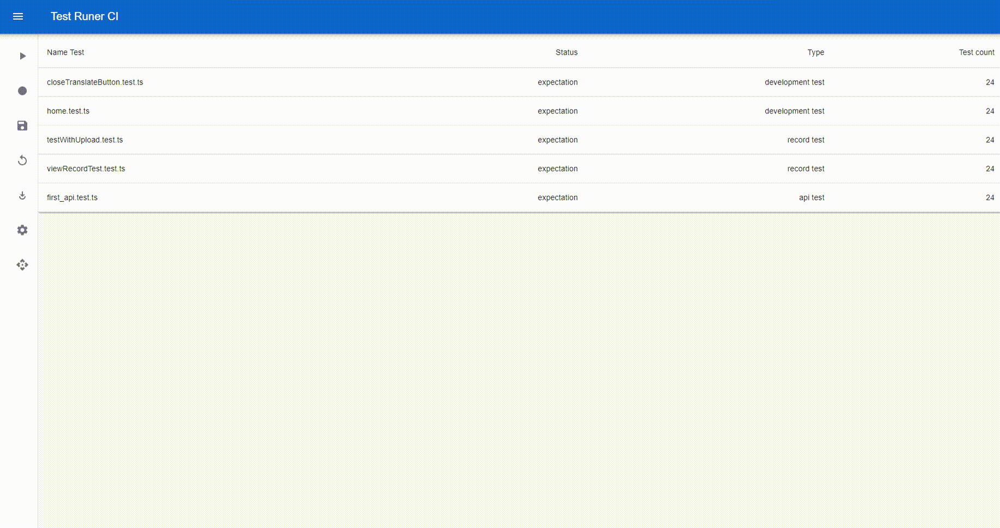

# TestRunner CI

A project designed for recording, editing, launching and forming autotests by functional testers without the need for knowledge of programming languages
___

___
The system consists of 7 main parts:

### Test launch system:
-Tests can be as previously recorded by programmers (development test);
-So are the systems recorded by users in the recording mode;
-So are the basics of tests;

___
### Test recording system:

___
### Text saving and editing system

___
### A system for creating and displaying reports based on the results of test runs:

___
### The system for obtaining and displaying the test structure:

___
### Configuring test launch settings:

___
### The system for creating editing and recording API tests:
